<a id="top"></a>

- [渲染效果](#渲染效果)
- [渲染器的整体结构](#渲染器的整体结构)
  - [整体流程](#整体流程)
  - [各个类的作用](#各个类的作用)
    - [整体的类图](#整体的类图)
    - [Shader](#Shader)
    - [Window](#Window)
    - [camera](#camera)
    - [mesh](#mesh)
    - [shader](#shader)
    - [texture](#texture)
    - [scene](#scene)
- [代码结构](#代码结构)
- [shader与描述性数据绑定方法](#shader与描述性数据绑定方法)
- [实现细节](#实现细节)
- [遇到的问题](#遇到的问题)
- [Thanks to](#Thanks to)


## 渲染效果


边缘高亮

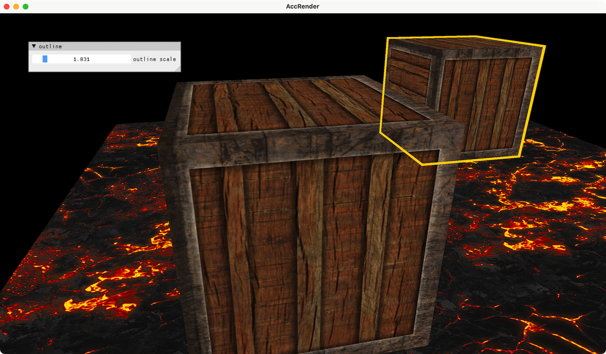


实例化绘制

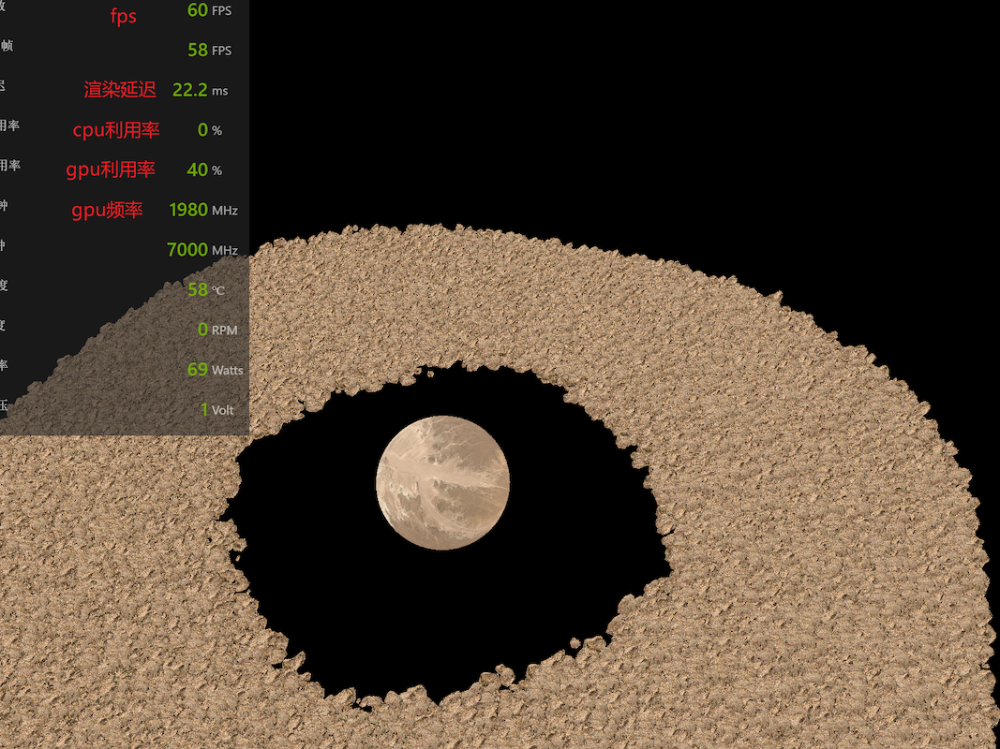


多种光源：点光源，方向光，聚光

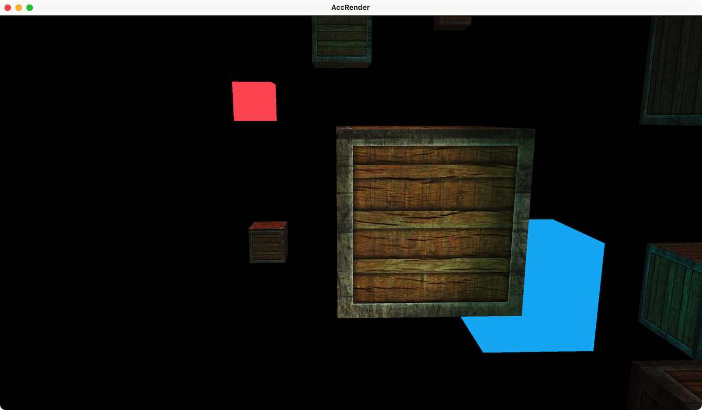


导入模型

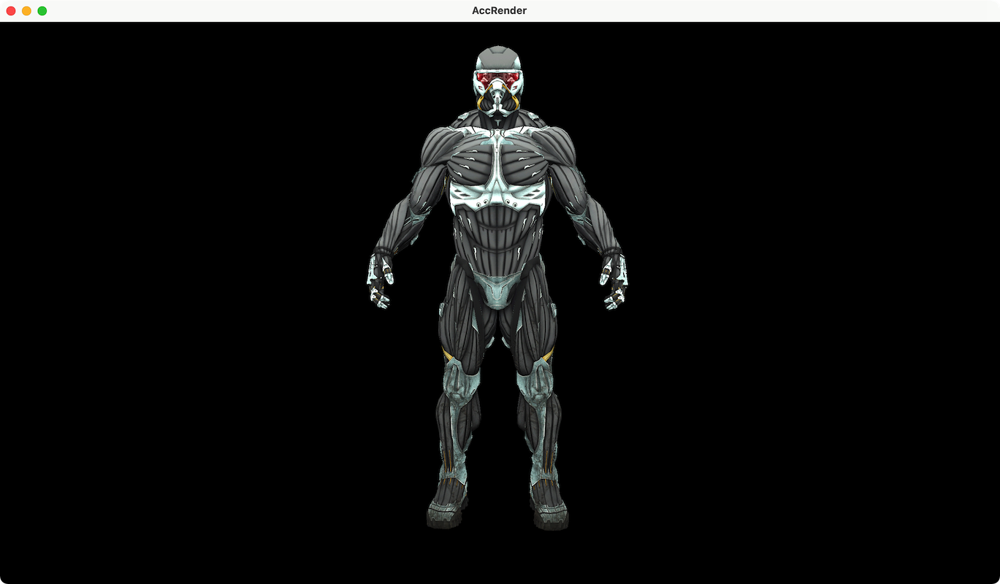


法线可视化

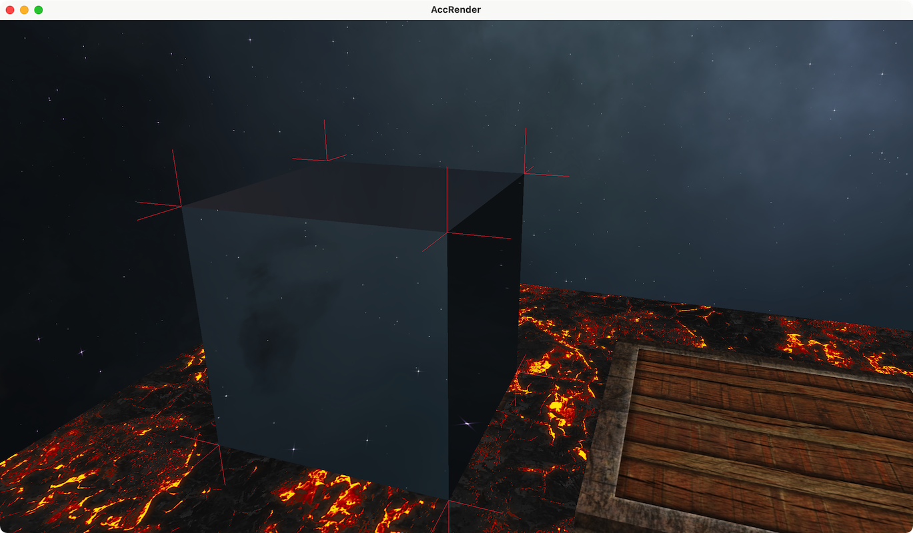


基于排序的透明

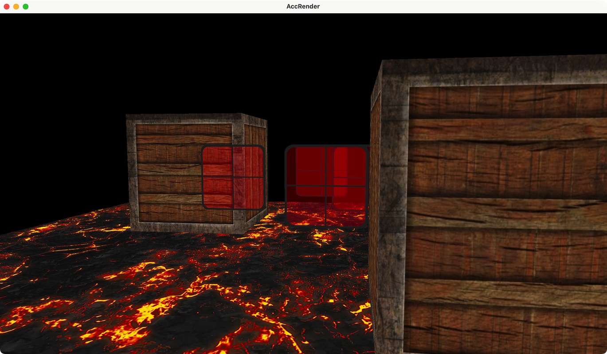


后期处理：边缘检测

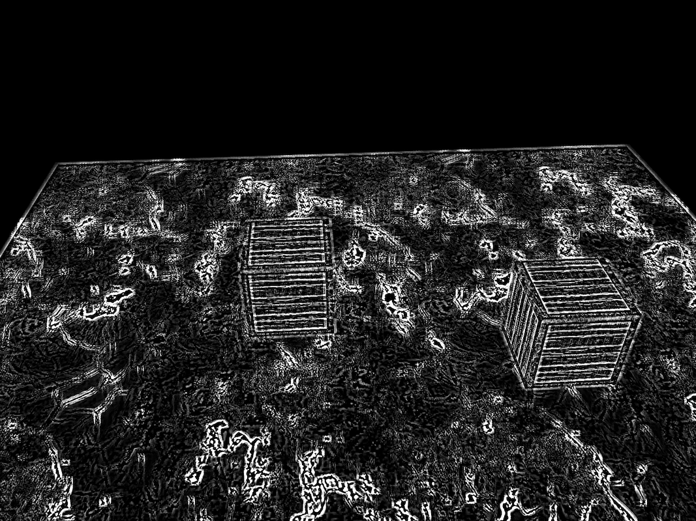


PBR-直接光照

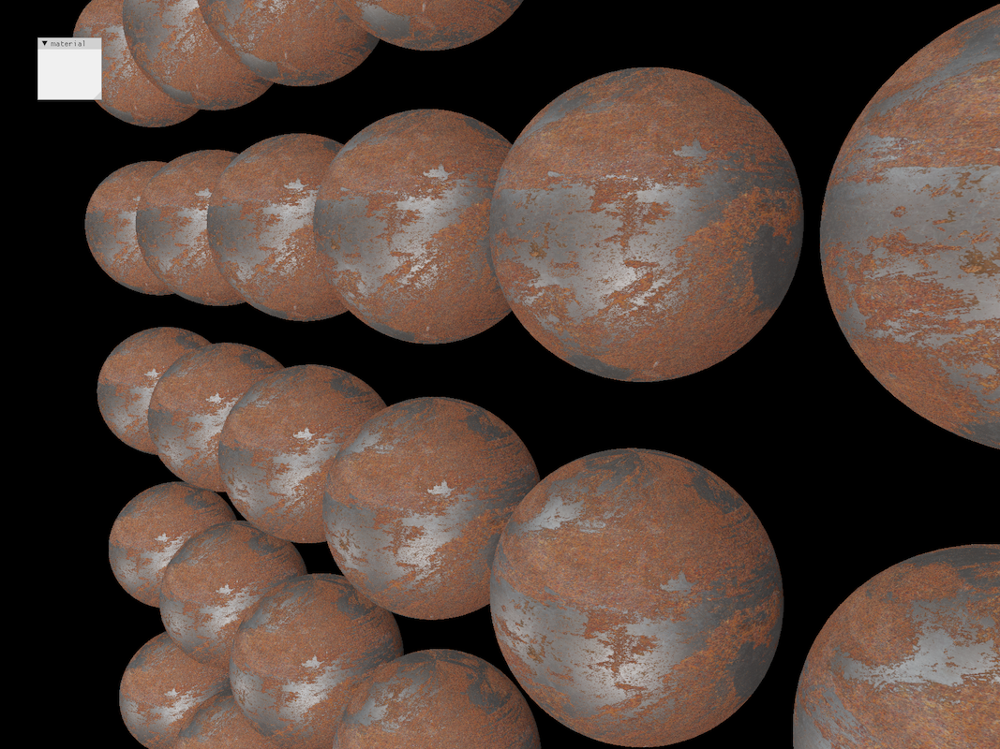


## 渲染器的整体结构

### 整体流程

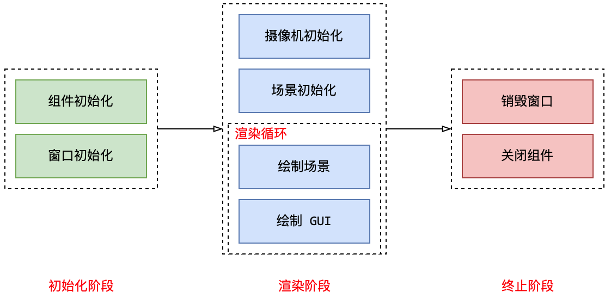


初始化阶段：

- 组件初始化：AccRender 引用了一些第三方库，比如 `glad, glfw, imgui` 等，在这里进行这些库的初始化
- 窗口初始化：AccRender 使用 `glfw` 作为窗口系统，在这个阶段创建一个窗口，并将其设置为 `OpenGL` 的上下文（注：目前的 AccRender 只支持一个窗口）

渲染阶段：

- 摄像机初始化：创建一个 `camera` 对象，作为 `render` 的静态成员（注：场景可以通过 `render::camera` 访问到摄像机）
- 场景初始化：这一部分可以根据场景在 `scene::_init()` 中自定义，可以包含这些操作：创建模型/纹理/着色器；为模型绑定纹理；为着色器绑定数据
- 绘制场景：这是渲染循环的主要部分，可以通过 `scene::_udpate()` 来自定义。这里会调用每个 `shader` 的 `update_per_frame()` 方法，来将每一帧都会变换的数据更新到着色器里面（比如摄像机相关的数据）;通过调用 `shader` 的 `draw(const Mesh &)` 方法来绘制具体的模型
- 绘制GUI：这是渲染循环的饿另一个部分，可以在 `scene::_gui()` 中自定义。GUI 相关的操作依赖于第三方库 `imgui` 

终止阶段：

- 销毁窗口：销毁 `render` 的 `window` 成员
- 关闭组件：销毁第三方组件，回收资源


### 各个类的作用

#### 整体的类图

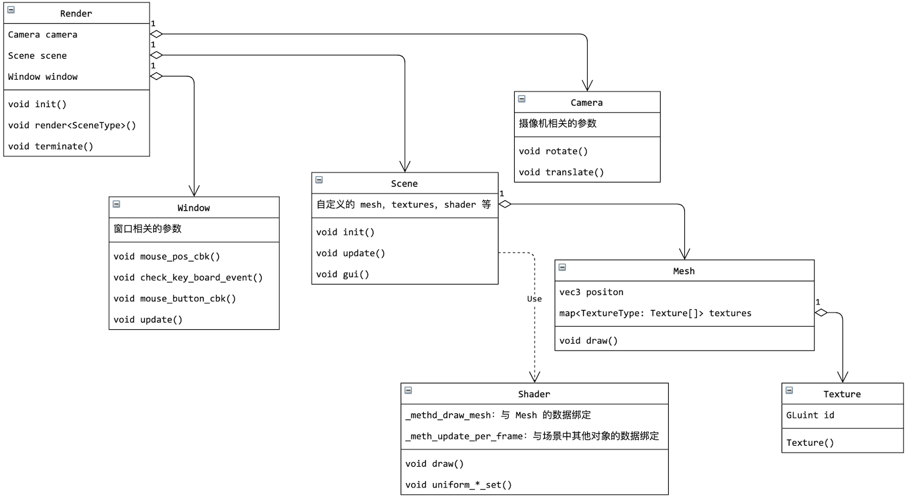


#### Shader

整个渲染的主流程实现在 `shader` 类中，包括：

- 创建全局的窗口系统，全局的摄像机
- 维护渲染循环，清空帧缓存，交换双缓冲
- 轮询 `window` 的键盘输入，在每一帧里面更新摄像机的位置和姿态
- 维护 GUI 的重绘
- 回收资源，结束程序


#### Window

- 是对 `glfw` 窗口的封装，提供了默认的 `framebuffer`，输入输出系统（提供了检测键盘的方法，鼠标位置改变的回调函数，检测鼠标按键的方法）


#### camera

- 全局的摄像机，通过摄像机相关的参数，提供了 `view matrix` 和 `model matrix`；使用欧拉角作为旋转系统


#### mesh

- `Mesh` 对象的实质是一系列的顶点和面，以及通过 `OpenGL` 创建的 `VAO, VBO, EBO` 对象

- 支持导入模型数据：基于 `assimp`，可以导入模型文件为 `Mesh` 类型的对象

- 提供了 `draw` 方法，可以绘制当前模型，需要提前设置好 `shader` 
- 每个 `Mesh` 对象都有一个纹理的列表，按照纹理的类型（diffuse，specular）来存放纹理


#### shader

- 可以根据以 `glsl` 编写的文件，调用 `OpenGL` 创建着色器程序
- 提供了设置着色器中 `uniform` 变量的方法
- 提供了以描述性语句为 `uniform` 变量绑定数据的方法
- 提供了绘制 `Mesh` 对象的方法

> 注：`update_per_frame()` 方法可以根据回调函数 `set_update_per_frame()` 的设置，在每一帧开始时更新一些 `uniform` 变量（比如 `view matrix`）。这个方法需要在场景中手动调用。
>
> 虽然可以提供将 `shader` 注册到 `render` 的机制，然后由 `render` 在合适的时机更新 `shader`，但是这样会导致整个渲染器结构变得很复杂，当前阶段暂不考虑


#### texture

- 从图像文件加载数据，调用 `OpenGL` 的借口创建纹理对象
- 可以创建普通的 2D 纹理，等距柱状投影的 HDR 纹理，以及 6 个方向单独存放的立方体贴图


#### scene

- 每个自定义的场景都应该继承自这个类
- 在 `_init()` 方法中进行模型的初始化，以及为 `shader` 绑定数据
- 在 `_update()` 方法中绘制模型
- 在 `_gui()` 方法中绘制 GUI


> **为什么 `window` 只有一个，而且是一个静态类？**
>
> 主要原因是 `glfw` 在注册回调函数时，必须要传入一个函数指针。虽然可以维护一个全局的 `GLFWwindow* - window对象` 的表，但这样做会增加项目的复杂度，且目前大概率用不上，所以当前的渲染器只支持一个 `window `
>
> 
>
> **摄像机应该作为 `render` 的成员还是作为 `scene` 的成员？**
>
> 考虑到摄像机在每一帧都需要读取键盘和鼠标输入，且 `window` 是一个全局对象，摄像机获取 `window` 数据时会涉及到渲染器的底层。为了将耦合的代码集中起来，因此在 `render` 中处理摄像机的输入输出，这样摄像机就完全不需要关注 `window` 了
>
> 
>
> **为什么有 model 这个类？**
>
> 一个 obj 文件中通常会有多个 mesh，整个 obj 通常是一个整体；model 类就是为了将多个具有关联的 mesh 组织起来的


## 代码结构

```shell
_
|__ assets
|   |__ model              # 模型文件
|   |__ obj                # 使用代码定义的模型
|   |__ texture            # 纹理图片
|__ engine                 # 渲染器的源文件
|__ examples               # 使用渲染器绘制场景的示例
|__ lib                    # 通过源代码引用的第三方库
|__ CMakeLists.txt         # 项目的配置
|__ config.in              # 通过 cmake 注入的相对路径定义
```


## shader与描述性数据绑定方法

`shader` 里面有很多的 `uniform` 变量需要和应用程序中的字段做绑定，`OpenGL` 提供了绑定变量的方法：

比如，着色器的代码为：

```glsl
uniform mat4 model;
uniform sampler2D texture_diffuse_0;
```

用于数据绑定的应用代码为：

```cpp
GLint location = glGetUniformLocation(shader_id, "texture_diffuse_0");
glUniform1i(location, texture_unit);
```

这些代码零散地分布在应用代码中，看起来不怎么直观


AccRender 使用了“描述性”地语句来进行数据绑定，让数据绑定集中在一起，比较直观：

```cpp
/* 为 shader 绑定数据，这些数据每一帧都会改变 */
some_shader->set_update_per_frame([](Shader &shader){
    shader.uniform_mat4_set("view", Render::camera->view_matrix_get());
    shader.unifrom_mat4_set("projection", Render::camera->projection_matrix());
});

/* 为 shader 绑定数据，这些数据会随着渲染的 Mesh 改变而改变 */
some_shader.set->set_draw([](Shader &shader, const Mesh &mesh){
    shader.uniform_mat4_set("model", mesh.model());
    shader.set_textures(mesh, {
        {"texture_diffuse_0", TextureType::diffuse, 0},
        {"texture_specular_0", TextureType::specular, 0},
    });
});
```


这种从“命令式”到“描述式”的变化，在我看来是很重要的


## 实现细节

### 立方体纹理的顺序

顺序示意图：

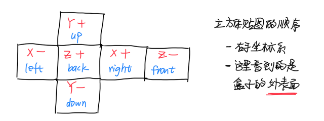


### 着色器中顶点属性的编号

顶点属性标准状态为：

```glsl
layout (location = 0) in vec3 aPos;
layout (location = 1) in vec3 aNormal;
layout (location = 2) in vec2 aTexCoord;
```


某个属性可以没有，也可以纬度不足，但一定要保证上述的 `glsl` 着色器可以兼容识别

VAO 对象的构成：

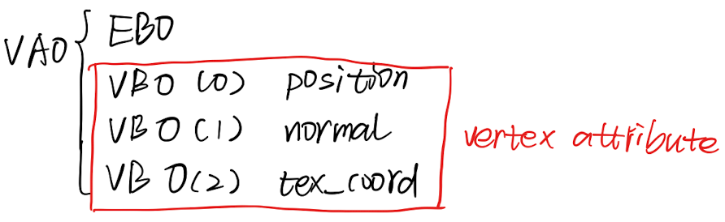


### 摄像机的设置

#### 摄像机的朝向

摄像机在世界坐标系中的初始朝向，以及使用欧拉角表示旋转：

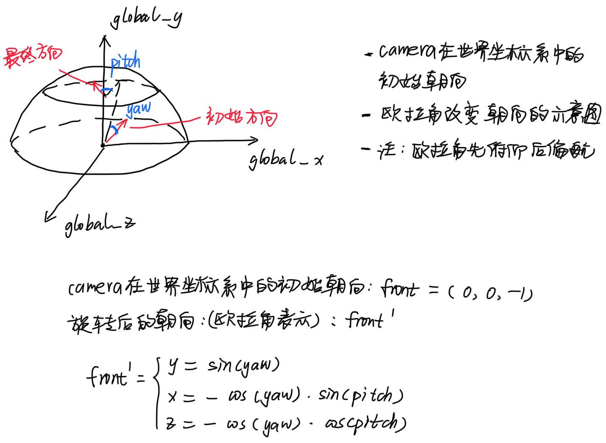


#### 摄像机的局部坐标系

局部坐标系是固定在摄像机上的，示意图为：

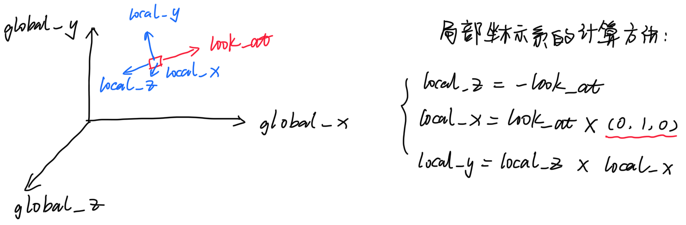


注：为了防止欧拉角死锁，以及让参考向量 `up=(0, 1, 0)` 有效，需要限定俯仰角为 `[-89, 89]`


#### 摄像机获得输入输出

目前的做法是：在摄像机中主动查看输入输出系统的数值，改变摄像机的位姿

考虑该用另一种方法：由 render 去获取输入系统的数值，并调用摄像机位姿改变的参数


## 遇到的问题


### glfw 的窗口尺寸问题

如果屏幕使用了缩放，将导致 glfw 一开始不能正确地显示内容

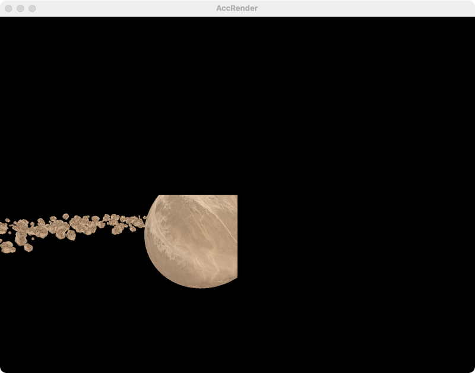


原因分析：

- 首先以特定的尺寸创建一个窗口，如 `800, 600`，并且将设置 OpenGL `glViewport(0, 0, 800, 600)` 
- 系统自动对该窗口进行缩放，该窗口的实际分辨率达到了 `1600, 1200` ，但并没有引起 `glfwFramebufferSize` 的事件
- 而且，如果此时调用 `glfwGetWindowSize` 查看窗口的尺寸，得到的仍然是 `800, 600`


解决办法就是：

1. 手动地调节一下窗口尺寸
2. 或者在开始时不要调用 `glViewport` 调节窗口的尺寸


## Thanks to

- glad
- glfw
- imgui
- spdlog
- fmt
- glm
- stb_image
- assimp


